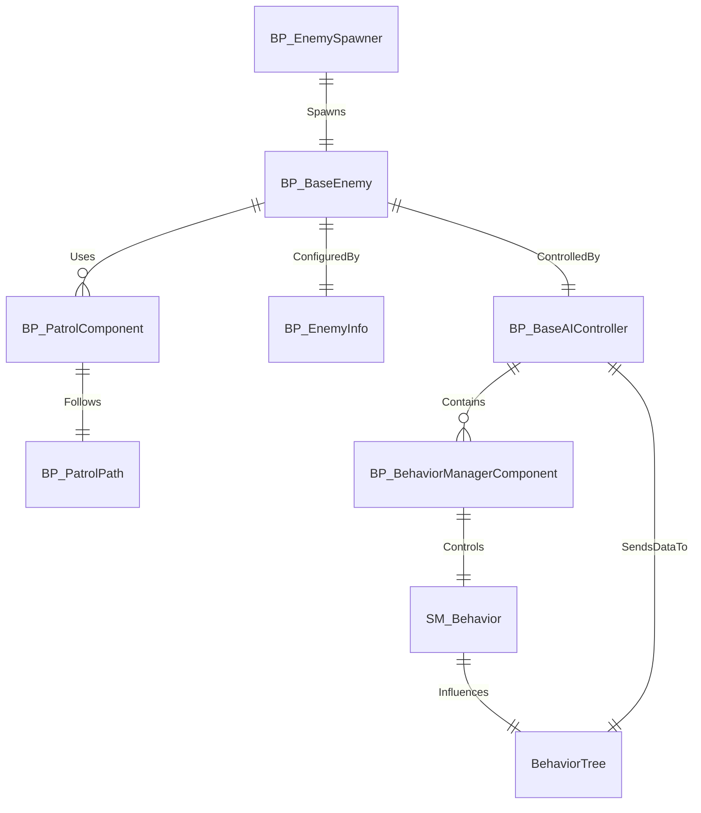

## Overview

The **Combat AI System** is a highly modular and extensible Blueprint-driven AI framework built for Unreal Engine 5. It enables the creation of advanced enemy behaviors through a hybrid system combining Finite State Machines (FSMs) with Behavior Trees. The system is ideal for action RPGs, Souls-like games, and any gameplay requiring responsive, tactical, and state-aware enemy AI. It empowers designers to define enemy logic visually with Blueprint states and behavior trees, while developers can extend its flexibility through data assets and custom components.

**Target Audience**: Unreal Engine developers and technical designers working on combat-focused games.

**Standout Features**:

- Modular FSM-Behavior Tree hybrid AI
- Data-driven AI behavior configuration via `EnemyInfo`
- Customizable combat styles and ability grants
- Integrated patrol system and enemy spawning
- Blueprint-first design with code extensibility
- **Data-Driven Customization**: Designers can define AI behavior entirely through Blueprint-based state machine subclasses and the `EnemyInfo` asset without writing code.
- Supports custom aggression curves, attack distances, strafing ranges, turn speeds, healing thresholds, and more
- Extendable behavior trees and FSM states for unique AI archetypes

---

## System Architecture

The Combat AI System is structured around key Blueprint classes and components:

### Classes and Components

- **BP_BaseEnemy**: Core enemy character class
- **BP_BaseAIController**: Controls AI logic and perception
- **BP_BehaviorManagerComponent**: Specialized FSM controller for AI behavior (attached to `BP_BaseAIController`)
- **SM_Behavior**: Base class for behavior state machines
- **BP_EnemyInfo**: Data asset defining behavior, abilities, combat style, and more
- **BP_PatrolComponent**: Manages patrol path logic
- **BP_PatrolPath**: Defines world patrol paths
- **BP_EnemySpawner**: Spawns enemies in the world

### Diagram

---

## Core Features

- **FSM + Behavior Tree Hybrid**: Use Behavior Trees for detailed tasks and FSMs for high-level state control.
- **Configurable Behavior Data**: Control aggression, distance thresholds, defense patterns, and more via child blueprints of `SM_Humanoid_CombatBehavior`.
- **Combat Styles and Abilities**: Define unique sets of abilities and animations for each enemy type.
- **Perception System**: Integrated AI perception using sight and damage sensing.
- **Targeting and Hostility System**: Dynamic hostile target detection and tracking.
- **Modular State Logic**: Extend or override behavior states via FSM nodes.
- **Enemy Info Asset**: Centralized configuration for attributes, abilities, visuals, and blackboard mapping.
- **Patrol System**: Path-based patrol logic with looping and directional control.
- **Spawner System**: Easily add enemies to levels with `BP_EnemySpawner`.
- **Behavior Configuration Flexibility**: Tune combat distance, movement speed, turning radius, healing conditions, retaliation logic, and more—all without modifying Blueprint logic.
- **Highly Customizable FSMs**: Child classes of `SM_Humanoid_CombatBehavior` provide full access to override and extend AI logic in a modular fashion.
- **Data-Driven Customization**: Designers can define AI behavior entirely through Blueprint-based state machine subclasses and the `EnemyInfo` asset without writing code.
- **Per-Enemy Behavior Tuning**: Each enemy variant can behave uniquely based on properties like attack frequency, movement range, and retaliation settings configured in child `SM_Humanoid_CombatBehavior` assets.
