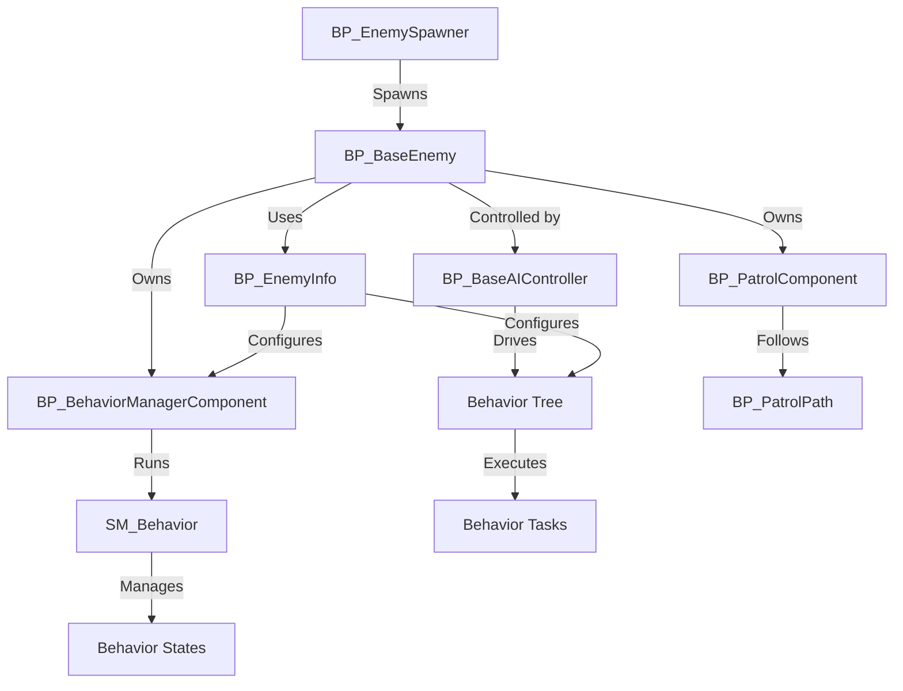

---
aliases:
  - Combat AI
---

The `Combat AI Behavior System`, part of the `Advanced ARPG Combat` framework in Unreal Engine 5, provides a modular and flexible solution for creating dynamic enemy AI in Action RPGs. It enables developers to craft rich combat behaviors for enemies, combining Blueprint-based finite state machines (FSMs) with Behavior Trees for precise control and extensibility. The system addresses the need for customizable, scalable AI behaviors, supporting scenarios from simple enemies to complex boss encounters. Targeted at game developers and designers working on RPGs, its standout features include pre-configured AI behaviors, extensive customization through data assets, and seamless integration with systems like `State Manager` and `Advanced Abilities`.

## System Architecture

The `Combat AI Behavior System` leverages Blueprints to manage enemy AI behaviors, integrating FSMs via the `State Manager System` with Behavior Trees for task execution. No C++ classes are required, ensuring accessibility. The system uses `Gameplay Tags` for identification, `Enemy Info` data assets for configuration, and components for modular functionality, enabling dynamic AI behavior driven by perception, abilities, and patrol systems.

- **Key Blueprint Classes**:
    - `BP_BaseEnemy`: Base character class that initializes AI components, manages health bars, and handles ragdoll functionality.
    - `BP_BaseAIController`: Controls AI perception, target selection, and Behavior Tree data flow, driving AI decision-making.
    - `BP_BehaviorManagerComponent`: Extends `BP_StateManagerComponent` to manage AI behavior states, interfacing with FSMs and Behavior Trees.
    - `SM_Behavior`: Base state machine class (derived from `BP_StateMachine`) for defining AI behavior transitions and logic.
    - `BP_EnemyInfo`: Data Asset for configuring AI properties, including abilities, combat styles, and attributes.
    - `BP_PatrolComponent`: Manages patrol logic, tracking position along a `BP_PatrolPath`.
    - `BP_PatrolPath`: Actor defining patrol points for AI navigation.
    - `BP_EnemySpawner`: Actor for spawning enemies, configurable with `BP_EnemyInfo`.

- **Data Flow**:
    - `BP_BaseEnemy` initializes components like `BP_BehaviorManagerComponent` and `BP_PatrolComponent`, using `BP_EnemyInfo` for setup.
    - `BP_BaseAIController` processes perception data (`UpdatePerception`), selects targets (`UpdateTarget`), and feeds data to the Behavior Tree.
    - `BP_BehaviorManagerComponent` runs `SM_Behavior` (e.g., `SM_Humanoid_CombatBehavior`) to manage state transitions, using `Gameplay Tags` and Blackboard values.
    - Behavior Trees execute tasks (e.g., attacks, movement) based on Blackboard data, with `SM_Behavior` controlling state-specific logic.
    - `BP_PatrolComponent` navigates `BP_PatrolPath` points, updating AI movement during patrol states.
    - `BP_EnemySpawner` instantiates `BP_BaseEnemy` instances, applying `BP_EnemyInfo` configurations.

## Core Features

- **Hybrid FSM and Behavior Tree System**:
    - Combines `SM_Behavior` FSMs with Behavior Trees for flexible AI behavior control.
    - **Benefits**: Offers precise state management with task-based execution, ideal for complex AI scenarios.
- **Configurable AI Behaviors**:
    - Customizes behaviors via `SM_Humanoid_CombatBehavior` properties (e.g., `Attack Distance`, `Enemy Aggression`) and Behavior Tree tasks.
    - **Benefits**: Allows extensive behavior tuning without coding, supporting diverse enemy types.
- **AI Perception and Targeting**:
    - Uses `BP_BaseAIController` to process perception (`UpdatePerception`) and select targets (`UpdateTarget`) based on `HostileTags`.
    - **Benefits**: Enables dynamic responses to players or other actors, enhancing combat realism.
- **Patrol System**:
    - Manages patrol routes via `BP_PatrolComponent` and `BP_PatrolPath`, with options like `bLoopPatrolPath` and `bReverseDirection`.
    - **Benefits**: Simplifies creation of patrolling enemies, adding depth to level design.
- **Enemy Spawning**:
    - Spawns enemies via `BP_EnemySpawner`, configured with `BP_EnemyInfo` for attributes, abilities, and behaviors.
    - **Benefits**: Streamlines dynamic enemy placement and initialization in levels.
- **Ability Integration**:
    - Grants abilities through `BP_EnemyInfo` and `GA_EnemyAbility` classes (e.g., `GA_EnemyMeleeAttack`), supporting melee, ranged, or magic combat.
    - **Benefits**: Enhances combat variety with customizable, animation-driven abilities.
- **Health and Ragdoll Management**:
    - Handles health bars (`ShowHealthBar`, `HideHealthBar`) and ragdoll physics (`EnableRagdoll`, `DisableRagdoll`) in `BP_BaseEnemy`.
    - **Benefits**: Improves visual feedback and immersion during combat and death sequences.