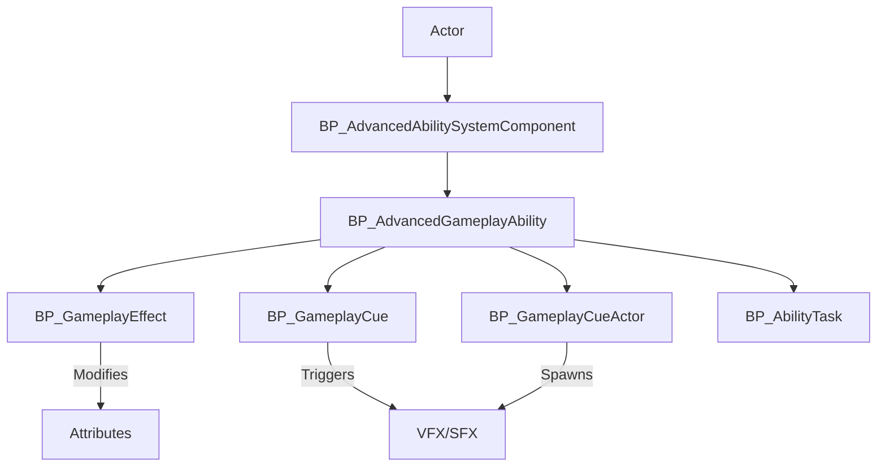

The **Advanced Abilities Framework** is a flexible, Blueprint-based ability and attribute system designed for Unreal Engine 5. It enables developers to create rich, stateful gameplay systems commonly found in RPGs, action games, and hybrid genres. This system allows for modular ability creation, attribute manipulation, and the orchestration of gameplay effects—all without relying on Epic’s GAS plugin.

**Purpose**:
- Provide a modular system for defining, activating, and managing gameplay abilities and their effects.
- Simplify the creation of state-based mechanics using gameplay tags, custom effects, and a visual Blueprint workflow.

**Target Audience**:

- Unreal Engine developers creating RPGs, action games, or hybrid systems.
- Teams seeking a Blueprint-based alternative to GAS.

**Key Features**:

- Fully Blueprint-based—no dependency on Epic's Gameplay Ability System.
- Includes support for gameplay effects, cues, and ability tasks.
- Designed for flexibility and customization.

---

## System Architecture

The system is composed of a set of core Blueprint classes that manage abilities, effects, and gameplay cues. These components interact via gameplay tags, event-driven logic, and class interfaces.

**Blueprint Classes**:

- `BP_AdvancedAbilitySystemComponent`: Manages ability ownership, activation, effects, and cue handling.
    
- `BP_AdvancedGameplayAbility`: Defines what an ability does, including cost and activation conditions.
    
- `BP_GameplayEffect`: Modifies attributes (e.g., buffs, debuffs, damage over time).
    
- `BP_AbilityTask`: Handles specialized tasks tied to an active ability.
    
- `BP_GameplayCueActor`: Spawns and manages persistent visual/audio effects.
    
- `BP_GameplayCue`: Data-driven cues for simple effects that don’t require actors.
    

**Class Interactions Diagram**:

- The `Actor` owns a `BP_AdvancedAbilitySystemComponent`, which stores and manages `BP_AdvancedGameplayAbility` instances.
- When abilities activate, they may spawn `BP_GameplayCueActor` or trigger `BP_GameplayCue` Data Assets.
- `BP_GameplayEffect` instances apply changes to attributes or grant temporary states.

---

## Core Features

- **Modular Ability Framework**: Create reusable, stateful abilities in Blueprint via `BP_AdvancedGameplayAbility`.
- **Gameplay Tags Integration**: Use tags to control activation conditions, blocking logic, and effect permissions.
- **Custom Gameplay Effects**:
    - Apply attribute modifications.
    - Support stacking, durations, periodic effects.
    - Include Execution logic for advanced calculations (e.g., damage formulas).
- **Gameplay Cues**:
    - Actor-based cues for persistent effects (e.g., casting circles, auras).
    - Data asset-based cues for simple effects (e.g., sparks, blood decals).
- **Ability Tasks**:
    - Isolated Blueprint actors that execute subtasks, tick logic, or persistent states.
- **Built-in Support for Cascade & Niagara**: Use either particle system in impact cue data assets.