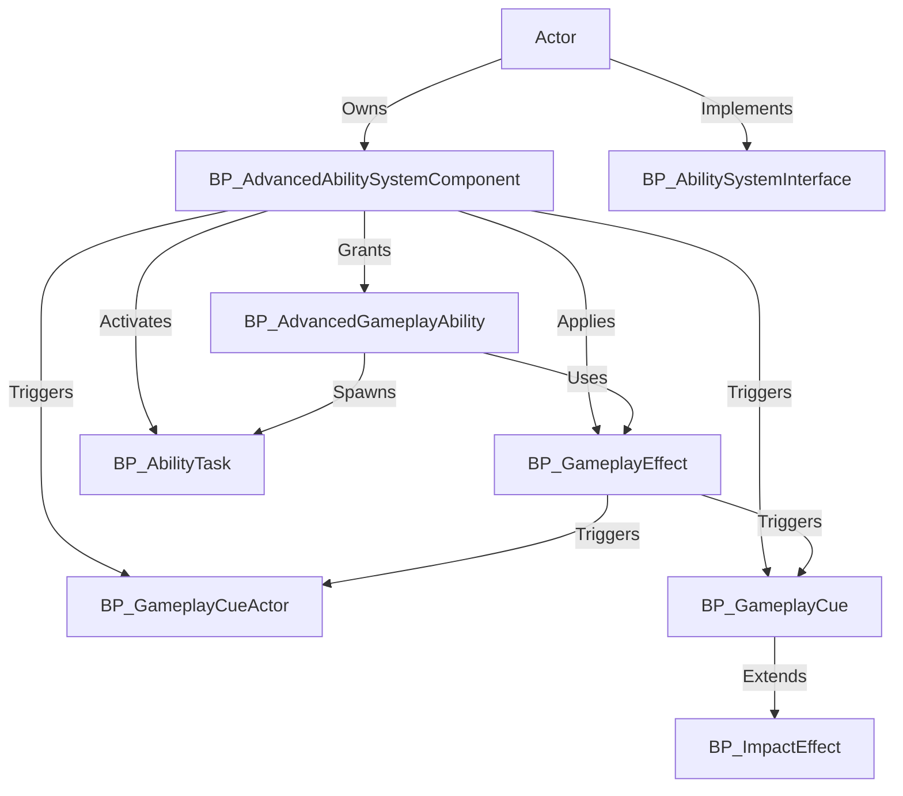

---
aliases:
  - Advanced Ability Framework
  - Advanced Abilities Framework
---
The `Advanced Abilities Framework` is a flexible, Blueprint-based system for Unreal Engine 5 projects, designed to create stateful gameplay mechanics for Action RPGs. It enables developers to build complex abilities, effects, and visual cues using `Gameplay Tags`, `Gameplay Abilities`, and `Gameplay Effects`. The framework addresses the need for modular, data-driven ability systems, allowing rapid iteration and customization without relying on Epic’s Gameplay Ability System. It targets game developers and designers building RPGs or similar genres, offering standout features like extensible ability logic, dynamic attribute modification, and a robust gameplay cue system for visual and audio feedback.

## System Architecture

The `Advanced Abilities Framework` is organized around a central `BP_AdvancedAbilitySystemComponent` that manages interactions between actors and system components. Blueprints handle ability execution, effect application, and visual/audio cues, ensuring accessibility for designers and developers. The system is entirely Blueprint-based, with no C++ dependencies, making it easy to extend and modify.

- **Key Blueprint Classes**:
    
    - **BP_AdvancedAbilitySystemComponent**: The core manager for abilities, effects, and cues on an actor. It initializes the system, grants abilities, and handles activation and effect application.
    - **[[Advanced Gameplay Ability|BP_AdvancedGameplayAbility]]**: Defines individual abilities (e.g., `GA_JumpAbility`), including activation conditions, costs, and custom logic.
    - **[[Gameplay Effects|BP_GameplayEffect]]**: Manages attribute changes (e.g., `GE_DamageEffect`), supporting instant, timed, or persistent modifications.
    - **[[Ability Task|BP_AbilityTask]]**: Executes specialized tasks (e.g., `BP_DelayedEffectTask`) for abilities requiring tick-based or delayed logic.
    - **[[Gameplay Cue Actor|BP_GameplayCueActor]]**: Spawns and controls complex visual/audio effects (e.g., `BP_ExplosionCue`) with stateful or stateless behavior.
    - **[[Gameplay Cue|BP_GameplayCueDataAsset]]**: A data asset (e.g., `BP_HitSound`) for simple particle or sound effects without actor spawning.
    - **BP_ImpactEffect**: A specialized `Gameplay Cue Data Asset` (e.g., `BP_Niagara_ImpactEffect`) for surface-specific impact effects like sparks or blood.
    - **BP_AbilitySystemInterface**: An interface for pawns to interact with the ability system, providing access to `BP_AdvancedAbilitySystemComponent`.

- **Data Flow**:
    - Actors (e.g., players or NPCs) possess a `BP_AdvancedAbilitySystemComponent`, initialized on `BeginPlay`.
    - Abilities (`BP_AdvancedGameplayAbility`) are granted via `Give Ability` or `Default Abilities` and activated using `Try Activate Abilities By Tag/Class`.
    - `Gameplay Effects` modify attributes (via `Apply Gameplay Effect`) and trigger `Gameplay Cues` for visual feedback.
    - `Ability Tasks` handle asynchronous or tick-based logic, while `Gameplay Cue Actors` and `Data Assets` manage effects.

## Core Features

- **Modular Ability System**:
    - Allows creation of custom abilities (e.g., `GA_Attack`) with Blueprint logic for activation, costs, and effects.
    - Benefits: Enables rapid prototyping and iteration of gameplay mechanics without C++ coding.
- **Data-Driven Gameplay Effects**:
    - Supports instant (e.g., damage), timed (e.g., buffs), or periodic (e.g., poison) attribute modifications via `BP_GameplayEffect`.
    - Benefits: Simplifies attribute management with designer-friendly properties like `Modifiers` and `Duration`.
- **Flexible Gameplay Cue System**:
    - Spawns visual/audio effects using `BP_GameplayCueActor` for complex effects (e.g., explosions) or `BP_GameplayCue` for simple effects (e.g., hit sounds).
    - Benefits: Enhances player feedback with customizable, surface-specific effects (e.g., `BP_ImpactEffect`).
- **Ability Tasks**:
    - Executes specialized logic (e.g., delayed effects) via `BP_AbilityTask`, supporting tick-based or one-off tasks.
    - Benefits: Offloads complex ability logic to reusable, modular tasks.
- **Tag-Based Activation Control**:
    - Uses `Gameplay Tags` (e.g., `Activation Required Tags`, `Block Abilities With Tag`) to manage ability execution and state.
    - Benefits: Provides precise control over ability interactions and prevents conflicts.
- **Cooldown Management**:
    - Implements ability cooldowns via `Start Cooldown` with configurable `CooldownTime` and `Cooldown Loop Interval`.
    - Benefits: Balances gameplay by limiting ability spam, with easy designer adjustments.
- **Extensibility**:
    - Supports custom child Blueprints for abilities, effects, tasks, and cues, integrated via `PlayerInfoDataAsset` or `BP_AdvancedAbilitySystemComponent`.
    - Benefits: Facilitates project-specific mechanics without modifying core system logic.