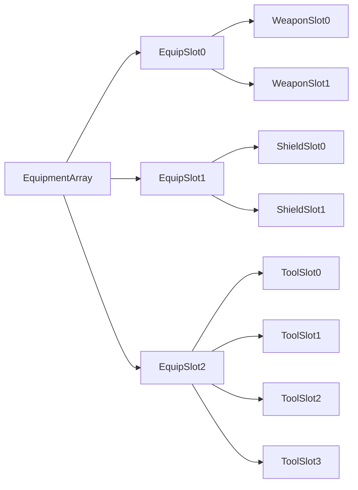

The equipment system is divided into multiple **Equipment Slots**. An **Equipment Slot** is a structure that stores different kinds of information such as the items and actors that are equipped in that **Equipment Slot**. Multiple equipment slots are supported such as Weapon Slot, Shield Slot, Ammo Slot, ect

![[EquipmentSlot.png]]

An Equipment Slot also contains the Equipment Slot Type associated with this Equipment Slot, Equip Spawn Setting, bool that determines if the equipment slot is disabled, the active equipped item index, the equipped item slots and equipped actors.

An **Equipment Slot** is not the same thing as an **item slot**. An item slot is how the item data is stored.

# Equipment Array & Equip Slot Design

The **Equipment Array** is an array of **Equipment Slots**. Each equipment slot is a different slot where a single actor or multiple actors can be equipped. Multiple equipment slots are supported such as Weapon Slot, Shield Slot, Ammo Slot, ect

You must build the Equipment Array yourself by opening the actor that holds the equipment component and selecting the details panel for the equipment component and using the “+” to create multiple equipment slots and associate them with an equipment slot type enum (Weapon slot, Ammo Slot, etc) and then creating a new array element for each item slot you want the equip slot to have.

NOTE: If you do not build the equipment array and you try to equip an item to an equipment slot that does not exist, you will get an error.

Each **Equip Slot** can have one or more **Item Slots** where one or more items can be equipped. However, only one item can be used at a time. For example, there may be multiple tools in the “Tools Slot” but only the “Active” tool can be used at any given time by pressing the use tool button.

# Active Item

As stated above, only one item can be used at a time. This item is known as the “Active Item”, which means this item is currently spawned and in active use by the equipping character. By default only the Active item will apply attribute modifiers and be spawned in the world. InActive items do not apply attribute modifiers (unless modified by the user in equipable class) and they do not get spawned in the world (this can be changed through equip spawn type setting).

# Equipment Spawn Setting

![[Equip Spawn Setting.png]]

Even though InActive Items are not spawned by default, they can be spawned by changing the “**Equip Spawn Setting**” found in the **Equipment Slot**. By default there are two options: “Spawn Active Item” and “Spawn All Items”. These do as you would expect, Spawn Active item will only spawn the active item while spawn all items will spawn all items whether they are active or not.

There is functionality implemented which will attach the active items to an active attach socket and the inactive items to a disabled equip socket. So, for example a weapon that is spawned but Inactive will be attached to a sheathe socket (these sockets can be setup either through the item data or equipable class).