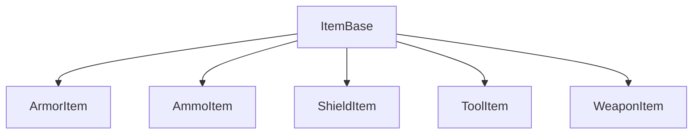

The item system stores the item data using Data Assets. Data Assets are meant to be data only, which means you should not manipulate variables in a data asset with code. You should only set the item data from within the data asset file in the editor window.

Items are located in:
`Content > AdvancedARPGCombat > AdvancedCombatFramework > InventorySystem > Items`

# Item Hierarchy

An inventory item, derived from the `BP_ItemBase` class, is the base data asset class for every item. From there, child classes are created to define certain default data for each item type. For example, a weapon would need a set of default data that is different from the default data for a tool or piece of armor.

# Base Item

The base item class is the `BP_ItemBase` data asset. This asset contains all the data that can define different types of items. I will provide some details on a few of the important variables.

| Property:             | Purpose:                                                                                                                   |
| --------------------- | -------------------------------------------------------------------------------------------------------------------------- |
| Equipable Actor Class | the item actor class that is associated with this item.                                                                    |
| Equip Slot            | the slot this item will equip to                                                                                           |
| Default Attach Socket | the starting attach socket when the item is inactive                                                                       |
| Active Attach Socket  | the attach socket when the item is active                                                                                  |
| Item ID               | optional string to identify items. This is not required and can be left blank, only use this if you have some need for it. |
| Item Type             | What type of item is this? This should define which item category this item belongs to                                     |
| Item Panel            | the inventory panel that this item will be added to                                                                        |
There are also other types of information that are item-specific. Such as weapon type, ammo type, armor type, etc.