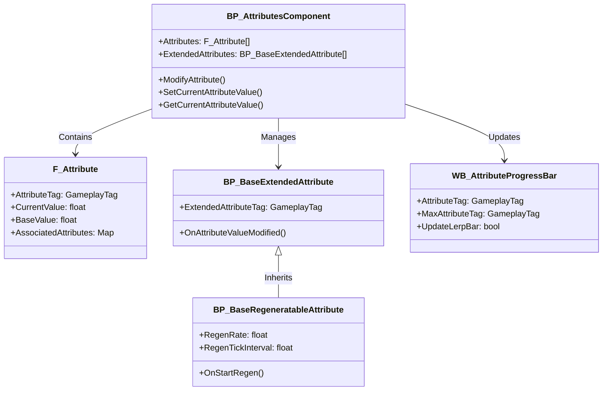

---
aliases:
  - Attributes System
---
The `Advanced Attributes System` is a flexible and modular system within the Advanced ARPG Combat framework for Unreal Engine 5. It enables developers to manage and modify gameplay-related floating-point attributes, such as health, stamina, or experience points, for actors in Action RPGs or similar genres. The system addresses the need for a robust, designer-friendly way to handle dynamic attribute values and their relationships, like souls-like leveling mechanics. It targets game developers and designers building RPGs or combat-focused projects, offering standout features like the `Associated Attributes System` for curve-based attribute scaling and regeneratable attributes for dynamic gameplay.

## System Architecture

The `Advanced Attributes System` is organized around a central actor component that manages attributes and their interactions. Data flows from the `BP_AttributesComponent` to structs, extended attributes, and UI widgets, with curve-based logic for associated attributes. The system is entirely Blueprint-based, requiring no C++ for core functionality.

- **Blueprints**:
    - **BP_AttributesComponent**: Core component attached to actors, managing an array of `F_Attribute` structs and `ExtendedAttributes`.
    - **[[Extended Attributes|BP_BaseExtendedAttribute]]**: Base class for extended attribute functionality, such as regeneration or custom logic.
    - **BP_BaseRegeneratableAttribute**: Derived from `BP_BaseExtendedAttribute`, handles regeneratable attributes like stamina.
    - **[[Attribute Progress Bar Widget|WB_AttributeProgressBar]]**: Widget for displaying attribute values on the HUD with progress bars.
- **Structs**:
    - **[[Attribute|F_Attribute]]**: Stores attribute data, including `AttributeTag`, current value, base value, and **[[Associated Attributes]]** map.

## Core Features

- **Attribute Management**:
    - Stores and modifies floating-point values (e.g., health, stamina) via `BP_AttributesComponent`.
    - Use `ModifyAttribute` to adjust values dynamically, e.g., `ModifyAttribute (AttributeTag: Attribute.Health, Value: -10)`.
    - Benefits: Simplifies tracking and updating actor traits without custom logic.
- **Associated Attributes System**:
    - Allows attributes to govern others using curve tables (e.g., `Attribute.Endurance` scales `Attribute.Stamina`).
    - Configure via the `AssociatedAttributes` map in `F_Attribute`, selecting curve rows for diminishing returns.
    - Benefits: Enables souls-like leveling with designer-friendly curve adjustments.
- **Regeneratable Attributes**:
    - Supports attributes that regenerate over time (e.g., stamina) via `BP_BaseRegeneratableAttribute`.
    - Set `RegenRate`, `RegenTickInterval`, and `RegenCoolDown` in the class defaults.
    - Example: Create `BP_StaminaRegen` with `ExtendedAttributeTag: Attribute.Stamina`, `RegenRate: 5`.
    - Benefits: Automates regeneration mechanics with customizable parameters.
- **HUD Integration**:
    - Displays attributes on the HUD using `WB_AttributeProgressBar`.
    - Set `AttributeTag` (e.g., `Attribute.Health`) and `MaxAttributeTag` (e.g., `Attribute.HealthMax`) in the widget.
    - Supports lerp animations for visual feedback (e.g., health decrease).
    - Benefits: Provides plug-and-play UI for attribute visualization.
- **Extended Attributes**:
    - Adds custom functionality via `BP_BaseExtendedAttribute` (e.g., trigger death when `Attribute.Health <= 0`).
    - Use `OnAttributeValueModified` to implement logic, e.g., `If GetCurrentAttributeValue (Attribute.Health) <= 0 -> Trigger Death`.
    - Benefits: Extends system flexibility for project-specific needs.
- **Event Dispatchers**:
    - Notifies other systems of attribute changes via `OnAttributeValueModified`, `OnCurrentAttributeValueUpdated`.
    - Example: Bind `OnAttributeValueModified` to update UI or trigger abilities.
    - Benefits: Facilitates integration with other gameplay systems.