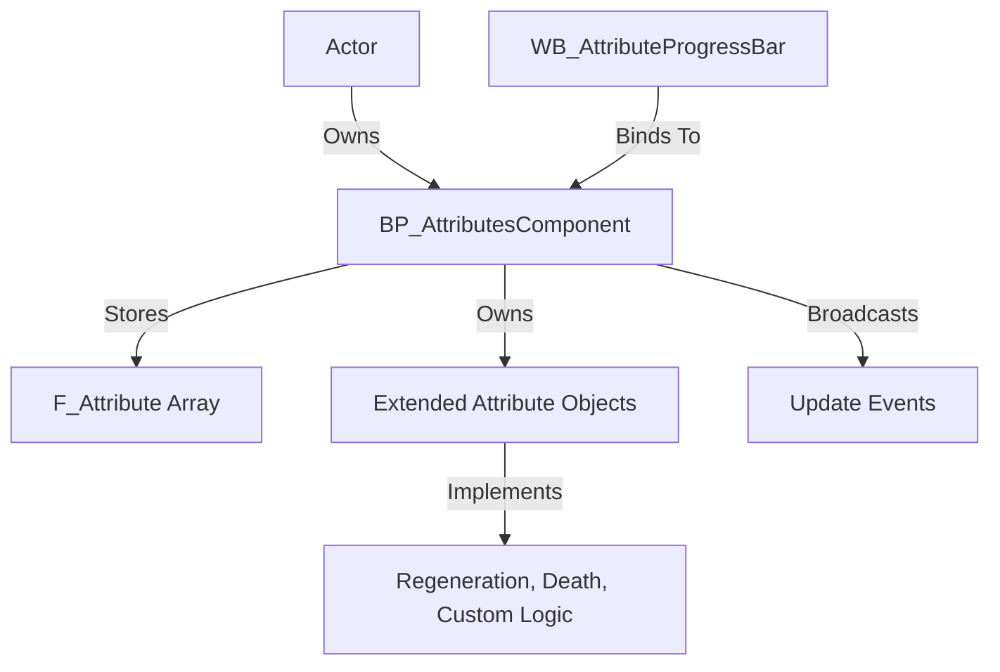

---
aliases:
  - Attributes System
---
The **Advanced Attributes System** is a comprehensive, Blueprint-based framework included in the Advanced ARPG Combat system for managing gameplay attributes such as health, stamina, movement speed, and more. It provides a scalable structure for defining, modifying, and interacting with attributes on any actor using an `Attributes Component`.

Designed with extensibility in mind, the system also features:

- **Associated Attributes**: Allow attributes like Vitality to govern others (e.g., Health), using designer-friendly curve tables for progression.

- **Extended Attributes**: Add modular functionality like regeneration or conditional death logic to specific attributes.

- **HUD Integration**: Built-in widget support to display attributes using `WB_AttributeProgressBar`.

**Target Audience**: Unreal Engine 5 game developers and designers creating action RPGs or other genres requiring an extensible attribute management system.

---

## System Architecture

### Core Components:

### Blueprint Classes

- **BP_AttributesComponent**: Manages all attributes and extended attribute objects.
- **BP_BaseExtendedAttribute**: Base class for creating custom logic per attribute.
- **BP_BaseRegeneratableAttribute**: Derived from `BP_BaseExtendedAttribute`, implements regeneration logic.
- **WB_AttributeProgressBar**: Displays any attribute visually on the HUD.

### Structs

- **F_Attribute**: Represents a single attribute's data, including base, current, percent, and multiplier values.

---

## Core Features

- **Attribute Storage and Access**
    - Store base/current/multiplier/percent values per attribute.
    - Access and modify attributes via Blueprint using gameplay tags.

- **Extended Attribute Functionality**
    - Create regeneration, event-driven logic (e.g., health reaching zero), or conditional triggers using modular extended attributes.

- **Associated Attributes System**
    - Define one attribute (e.g., Strength) to govern others (e.g., AttackPower) using curve-based relationships.

- **Progress Bar HUD Support**
    - Easily integrate attribute display using `WB_AttributeProgressBar`, complete with customizable styling and lerp feedback.

- **Persistent Attributes**
    - Mark certain attributes (e.g., XP, Souls) to persist modifier values across save/load sessions.

---