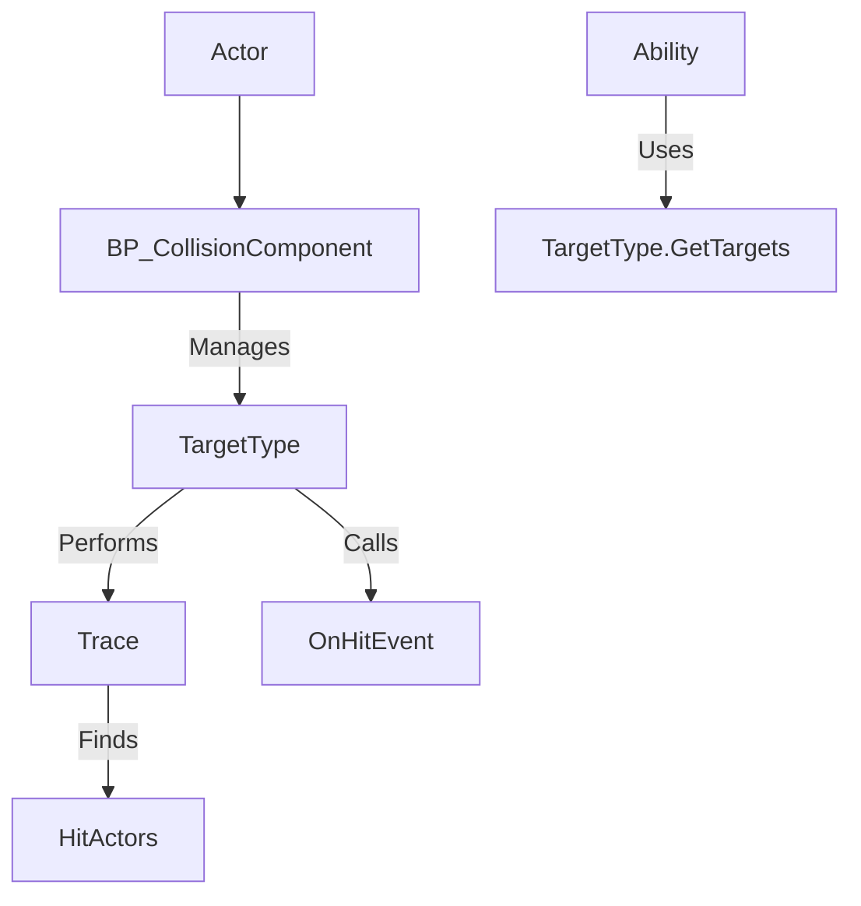

The **Collision Manager System** is a modular Blueprint-based framework designed for Unreal Engine 5. It enables trace-based collision detection for weapons, actors, and abilities, and offers a flexible interface for querying nearby targets. Integrated within the Advanced ARPG Combat system, it serves as both a hit detection mechanism and a targeting provider for gameplay abilities and effects.

This system solves the problem of managing dynamic combat hitboxes and selecting appropriate targets for combat logic. It is intended for developers building action-oriented games where responsive melee collision, projectile hits, and smart target acquisition are critical.

**Key Features:**

- Trace-based hit detection with fine control over collision logic
- Built-in support for trace targets, sweeping socket-based hitboxes, and animation-driven collision timing
- Modular TargetType framework for targeting queries
- Tag-based collision management
- Expandable architecture for complex ability targeting

---

## System Architecture

The Collision Manager System is built around a component-and-handler model. Each actor can host a `BP_CollisionComponent` which manages `TargetType` objects responsible for performing and responding to collision queries.

### Key Blueprint Classes

- **BP_CollisionComponent**: Core component attached to an actor that manages active collision target types and hit detection.
- **BP_TargetType**: Base UObject for defining custom collision/targeting logic. Can be extended for single-target or multi-target queries.
- **BP_TraceTarget**: Derived from `BP_TargetType`, enables continuous tracing for collision detection.
- **BP_SweepingSocketTraceTarget**: Specialized trace class using sockets for precise melee collision.
- **ANS_CollisionTrace**: Animation notify state used to activate/deactivate traces during animations.

---

## Core Features

- **Trace-Based Hit Detection**
    - Activate/Deactivate trace hitboxes dynamically.
    - Works with sweeping sockets for melee weapons.
- **Target Acquisition Support**
    - Provides functionality for finding targets via `GetTarget` or `GetTargets`.
    - Used for gameplay abilities and effects that require a recipient.
- **Tag-Based Collision Routing**
    - Collision types are indexed by gameplay tags for flexible activation.
- **Modular Collision Trails**
    - Optionally define visual trails per trace (StartTrail, EndTrail).
- **Collision Filtering**
    - Ignore actors via tag, class, or collision profile.
