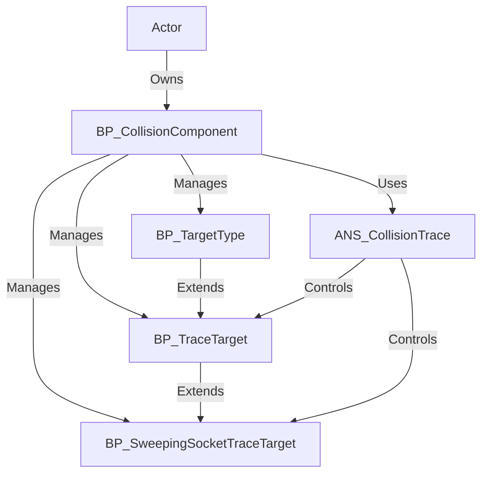

---
aliases:
  - Collision Manager
---
The `Collision Manager` is a Blueprint-based system for Unreal Engine 5 projects, designed to handle trace hit detection and target selection for Action RPGs and combat-focused games. It enables developers to manage collision detection for weapons and find targets for `Gameplay Abilities` and `Gameplay Effects` without requiring complex collision setups. The system addresses the need for precise, flexible hit detection and targeting, supporting mechanics like melee swings, projectile targeting, and ability lock-on. It targets game developers and designers building combat systems, offering standout features like modular target types, tick-based tracing, and animation-driven collision control.

## System Architecture

The `Collision Manager` is organized around the `BP_CollisionComponent`, which serves as the central hub for managing collision target types and trace logic. Blueprints handle collision detection, target selection, and integration with other systems like the [[Ability Framework Overview|Advanced Abilities Framework]]. The system is entirely Blueprint-based, ensuring accessibility for designers and developers without C++ dependencies.

- **Key Blueprint Classes**:
    
    - **BP_CollisionComponent**: Manages collision target types for an actor, enabling hit box creation and target searches. It initializes default target types, activates/deactivates collisions, and handles target queries.
    - **[[Target Type Class|BP_TargetType]]**: Base class for collision handler objects, used for custom or one-off target searches, particularly for abilities requiring specific targets.
    - **[[Collision Trace Target|BP_TraceTarget]]**: Base class for trace-based collision handlers, supporting continuous tick-based tracing until deactivated, ideal for persistent hit detection.
    - **[[Sweeping Socket Trace Target|BP_SweepingSocketTraceTarget]]**: Specialized trace target for melee attacks, using mesh sockets to define precise collision paths for weapon swings.
    - **ANS_CollisionTrace**: Animation Notify State that activates/deactivates trace collisions during specific animation frames, ensuring precise timing for melee hit boxes.
- **Data Flow**:
    
    - Actors (e.g., characters, weapons) possess a `BP_CollisionComponent`, initialized on `BeginPlay` with default target types via `DefaultTargetTypeMap` or `DefaultTargetTypes`.
    - `BP_TargetType` or its derivatives (`BP_TraceTarget`, `BP_SweepingSocketTraceTarget`) are added to `BP_CollisionComponent` using `AddCollisionTargetType`.
    - Collisions are activated/deactivated via `ActivateCollisionByTag`/`DeactivateCollisionByTag` or `ANS_CollisionTrace`, triggering trace logic or target searches.
    - Targets are queried using `FindTargetsByClass` or `GetTarget`/`GetTargets` for ability targeting, with results passed to abilities or effects.

## Core Features

- **Trace Hit Detection**:
    - Enables weapons to detect hits using trace-based collision without adding `BP_CollisionComponent` directly to the weapon actor.
    - **Benefits**: Simplifies hit box setup for weapons, supporting precise collision detection for melee or projectile attacks.
- **Target Selection for Abilities**:
    - Finds single or multiple targets for `Gameplay Abilities` and `Gameplay Effects` using `BP_TargetType` or trace-based classes.
    - **Benefits**: Facilitates lock-on mechanics, AoE targeting, or ability-specific target searches, enhancing combat dynamics.
- **Modular Target Types**:
    - Supports custom `BP_TargetType` children for one-off searches, `BP_TraceTarget` for continuous tracing, and `BP_SweepingSocketTraceTarget` for melee swings.
    - **Benefits**: Offers flexibility to tailor collision and targeting to specific gameplay needs, reusable across actors.
- **Animation-Driven Collision**:
    - Uses `ANS_CollisionTrace` to activate/deactivate trace collisions during specific animation frames, aligning hit boxes with attack visuals.
    - **Benefits**: Ensures precise timing for melee attacks, improving visual and gameplay fidelity.
- **Configurable Collision Parameters**:
    - Provides properties like `Collision Radius`, `Collision Object Types`, and `Gameplay Tags to Ignore` to customize trace behavior.
    - **Benefits**: Allows fine-tuned control over what collisions detect, reducing false positives and enhancing performance.
- **Sweeping Melee Support**:
    - `BP_SweepingSocketTraceTarget` uses mesh sockets for accurate melee swing traces, with adjustable trace paths and collision properties.
    - **Benefits**: Delivers realistic weapon collision for melee combat, supporting varied attack animations.