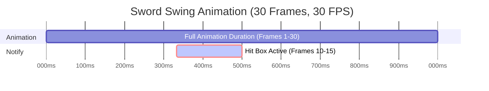

### Creating and Using a Custom Target Type

1. Create a new Blueprint that inherits from `BP_TargetType`.

2. Override `GetTarget` or `GetTargets` to define how targets are located.

3. In your ability or actor logic, call `FindTargetsByClass` from the collision component.

4. Process the result as needed in your ability logic.

```blueprint
GetPerformingActor -> GetComponentByClass(Class: BP_CollisionComponent) -> FindTargetsByClass(Class: MyCustomTargetTypeClass) -> Do Something With Targets
```

### Adding a Sweeping Melee Trace

1. Create a child of `BP_SweepingSocketTraceTarget`.
	1. Adjust default properties for the new trace target as needed for custom trace target
	2. Override and modify functionality as needed for custom trace target

2. In your actor or weapon, call `AddCollisionTargetType` with:
    - Tag (e.g., `Collision.SwordTrace`)
    - Class reference (e.g., your custom sweeping trace)
    - Performing Actor (usually the weapon or character)

```blueprint
BeginPlay -> AddCollisionTargetType(TargetTypeTag: Collision.SwordTrace, TargetTypeClass: MyCustomSweepingTrace)
```

3. After calling `AddCollisionTargetType` initialize collision with the following:
	1. `AddCollisionTargetType` will return the target type that was added, from there you can call `SetCollisionProperties` to set the weapon mesh as well as set the collision socket names. 

```blueprint
BeginPlay -> AddCollisionTargetType(TargetTypeTag: Collision.SwordTrace, TargetTypeClass: MyCustomSweepingTrace) -> SetCollisionProperties(Mesh: WeaponMesh, Sockets: WeaponMesh->GetAllSockets)
```

4. Use `ANS_CollisionTrace` to activate and deactivate the trace in your animation.
	1. Add the `ANS_CollisionTrace` anim notify state to the animations that you wish to have melee hit box collision.
	2. Set the correct target type tag for the hit box (e.g. Collision.SwordTrace)
	3. Set any necessary data such as attack data, if the melee attack requires custom attack data



### Triggering Collision from Gameplay Ability
If triggering the collision through scripting logic (Not using the `ANS_CollisionTrace`) then do the following:

1. Get a reference to the actor’s `BP_CollisionComponent`.
2. Call `ActivateCollisionByTag`:
	1. Get a reference to the desired actors `BP_CollisionComponent`
	2. Call `ActivateCollisionByTag`with the desired collision target tag

```blueprint
GetPerformingActor -> GetComponentByClass(Class: BP_CollisionComponent) -> ActivateCollisionByTag(GameplayTag: Collision.MyTargetType)
```

3. Call `DeactivateCollisionByTag` when finished.
	1. Get a reference to the desired actors `BP_CollisionComponent`
	2. Call `DeactivateCollisionByTag`with the desired collision target tag

```blueprint
GetPerformingActor -> GetComponentByClass(Class: BP_CollisionComponent) -> DeactivateCollisionByTag(GameplayTag: Collision.MyTargetType)
```

4. Alternatively, use `FindTargetsByClass` to query targets directly.

```blueprint
GetPerformingActor -> GetComponentByClass(Class: BP_CollisionComponent) -> FindTargetsByClass(Class: MyCustomTargetTypeClass) -> Do Something With Targets
```

---

## Best Practices

- Use gameplay tags consistently to organize collision types.
- Reuse `TargetType` classes for similar abilities or weapons.
- For socket-based collision, ensure socket naming is consistent across meshes.
- Use `CollisionTrace` debug draw settings during development to visualize hitboxes.
- Always deactivate collision traces to avoid unintended hits.

---

## Notes

- The system is entirely Blueprint-based and highly modular.
- Integrated with Advanced Gameplay Abilities and Effects for target resolution.
- Animation Notifies provide frame-perfect control for melee hits.
- Easily extendable with custom logic via child TargetType classes.

---