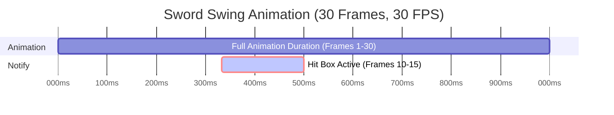

This guide provides detailed instructions on using the `Collision Manager` in an Unreal Engine 5 project, covering key workflows for managing trace hit detection, target selection for abilities, and customizing collision behavior. Users will learn how to activate/deactivate collisions, query targets for `Gameplay Abilities` and `Gameplay Effects`, and create custom collision target types to extend the system for project-specific needs. The guide is designed for developers and designers working on Action RPGs or combat-focused games.

### Activating and Deactivating Collisions

Activate collisions to detect hits or trigger `Gameplay Effects` during attacks or abilities, and deactivate them to stop tracing.

#### Animation-Driven Collisions (Melee Attacks)

- Ensure the correct `Collision Target Type` is added to the collision component either by setting it in the class defaults for the Collison component, Player or Enemy Info Data Assets, or the Weapons `Collision Trace Class` (In the weapons class defaults).
- Example:
```blueprint
// Class Defaults | Initialization
- CollisionTraceTarget = BP_MyCollisionTraceTarget
```

- Ensure an `ANS_CollisionTrace` Anim Notify State is added to the attack animation (e.g., `Anim_SwordSwing`).
    - In the Notify’s Details panel, set `Collision Target Tag` (e.g., `Collision.SwordTrace`) to match the target type in `BP_CollisionComponent`.
    - The collision activates/deactivates automatically during the specified animation frames.
    - Example:


#### **For Scripted Collisions (Abilities)**:
- Get the actor’s `BP_CollisionComponent`.
- Call `ActivateCollisionByTag` with the desired `Gameplay Tag`:
```blueprint
 ActivateAbility -> Get Component By Class (Class: BP_CollisionComponent) -> ActivateCollisionByTag (GameplayTag: Collision.AOE)
```

- Call `DeactivateCollisionByTag` when the collision is no longer needed:
```blueprint
EndAbility -> Get Component By Class (Class: BP_CollisionComponent) -> DeactivateCollisionByTag (GameplayTag: Collision.AOE)
 ```

### Querying Targets for Abilities

Use the `Collision Manager` to find targets for [[Advanced Gameplay Ability|Gameplay Abilities]] or [[Gameplay Effects]], such as returning a specific target, tracing for targets in the world, AoE(Area of Effect) targeting, etc.

1. Get the actor’s `BP_CollisionComponent`.
2. Call `FindTargetsByClass` with the desired `BP_TargetType` class to retrieve targets:
    ```blueprint
    Enhanced Input Action (IA_TargetAbility) -> Get Component By Class (Class: BP_CollisionComponent) -> FindTargetsByClass (Class: BP_TargetType) -> Store Targets -> Apply Gameplay Effect
    ```

3. Process the returned targets in your ability logic (e.g., apply a `Gameplay Effect` to the first target).

### Adding Collision Target Types to Actors

Add collision target types to enable hit detection or targeting for specific actors (e.g., weapons, characters).

#### For Melee Collision

1. In the actor’s Blueprint (e.g., `BP_Sword`), on `Event BeginPlay`, get the owner’s `BP_CollisionComponent`.
	- Ensure owning actor (Actor that owns the melee weapon) has collision component added.
2. Configure Weapon with Default Collision:
    - Open your weapon Blueprint (e.g., `BP_Sword`).
    - Ensure it has a `SkeletalMeshComponent` with sockets defined (e.g., `StartSocket`, `EndSocket`) for `BP_SweepingSocketTraceTarget`.
    - In the weapon’s Class Defaults, search for `Collision Trace Class` and set the default target type for the weapon:
```blueprint
// Class Defaults | Initialization
- CollisionTraceTarget = BP_MyCollisionTraceTarget
```

3. Optionally, Call `AddCollisionTargetType` with the appropriate parameters (If need custom collision parameters):
    ```blueprint
    Event BeginPlay -> Get Owner -> Get Component By Class (Class: BP_CollisionComponent) -> AddCollisionTargetType (TargetTypeTag: Collision.SwordTrace, TargetTypeClass: BP_SweepingSocketTraceTarget, PerformingActor: Self)
    ```

4. Optionally, set collision properties (If need custom collision parameters):
    ```blueprint
    AddCollisionTargetType -> SetCollisionProperties (Mesh: SkeletalMeshComponent, Sockets: StartSocket, EndSocket)
    ```


> [!NOTE] Note:
> For things such as unarmed melee, the process is similar except instead of adding the collision target type class in the weapon, the target type class needs to be added either to the pawns initialization data (e.g., through Class Defaults or Info Data Assets) or optionally on begin play through a similar process as shown above.

5. Set Up Animation Notify for Melee Collision:
    - Open an attack animation (e.g., `Anim_SwordSwing`) included in the demo content.
    - Add an `ANS_CollisionTrace` Anim Notify State to the desired frames where the attack should detect hits.
    - In the Notify’s Details panel, set:
        - `Collision Target Tag`: `Collision.SwordTrace`
        - `Attack Data`: Optional; leave as null to use default trace settings.
        - `Trace Radius Modifier`: 0 (or adjust for wider/narrower traces).
    - Verify the animation is assigned to an Animation Blueprint used by `BP_PlayerCharacter`.

#### For Continuous Actor Tracing Collision
Continuous tracing collision can easily be added to any actor using the default `BP_CollisionTrace` class. 

1. Add Required Components
	- Add Collision Manager component to actor itself
	- Add Box Collisions for all required collision locations and adjust box collisions to appropriate locations
2. In the actor’s Blueprint (e.g., `BP_MeteorCueActor`), on `Event BeginPlay`, get the Actors `BP_CollisionComponent`.
3.  Call `AddCollisionTargetType` with the appropriate parameters:
    ```blueprint
    Event BeginPlay -> Get Owner -> Get CollisionComponent -> AddCollisionTargetType (TargetTypeTag: Collision.MyTraceCollision, TargetTypeClass: BP_MyTraceTarget, PerformingActor: Self)
    ```

4. Set collision meshes:
    ```blueprint
    AddCollisionTargetType -> SetCollisionMeshes(BoxCollisionsArra)
    ```

5. Add On Hit Event:
	- Click on Collision Component in custom actor
	- scroll to bottom and select add event for `OnHit`
	- Implement custom functionality for `OnHit` to handle the collision registering a hit

6. Activate/Deactivate Collision:
	- For Gameplay Cues or Ability Effects activate when the effect or cue starts
	- After a small delay call deactivate collision

### Creating Custom Collision Target Types

Extend the system by creating custom `BP_TargetType`, `BP_TraceTarget`, or `BP_SweepingSocketTraceTarget` children for project-specific collision needs.

#### Custom Target Type for Ability Targeting:

1.  Create a new Blueprint inheriting from `BP_TargetType` (e.g., `BP_MyCustomTargetType`).
    - Override `GetTarget` or `GetTargets` to define custom target selection logic:
 ```blueprint
 GetTarget -> Line Trace By Channel (TraceChannel: Visibility, Start: ActorLocation, End: ActorLocation + ForwardVector * 1000) -> Return Hit Actor
 ```

2. Use in an ability:
```blueprint
 ActivateAbility -> Get Component By Class (Class: BP_CollisionComponent) -> FindTargetsByClass (Class: BP_MyCustomTargetType) -> Apply Gameplay Effect To Target
 ```

#### Custom Trace Target for Continuous Tracing:
1. Create a new Blueprint inheriting from `BP_TraceTarget` (e.g., `BP_MyTraceTarget`).
    - Override `CollisionTrace` to customize trace behavior:
        ```blueprint
        CollisionTrace -> Multi Line Trace By Channel (TraceChannel: Weapon, Start: ActorLocation, End: ActorLocation + ForwardVector * 500) -> Process Hits
        ```

    - Override `OnHit` to apply effects:
        ```blueprint
        OnHit -> Apply Gameplay Effect By Class (Class: GE_DamageEffect, Target: Hit Actor)
        ```

2. Add to `BP_CollisionComponent`:
```blueprint
Event BeginPlay -> Get Component By Class (Class: BP_CollisionComponent) -> AddCollisionTargetType (TargetTypeTag: Collision.MyTrace, TargetTypeClass: BP_MyTraceTarget, PerformingActor: Self)
 ```

#### Custom Sweeping Socket Trace Target for Melee Attacks
1. Create a new Blueprint inheriting from `BP_SweepingSocketTraceTarget` (e.g., `BP_MySweepingTrace`).
    - Override `CollisionTrace` to adjust trace paths or `OnHit` for custom hit effects.
    - Add to `BP_CollisionComponent` and set mesh/sockets:
```blueprint
 Event BeginPlay -> Get Component By Class (Class: BP_CollisionComponent) -> AddCollisionTargetType (TargetTypeTag: Collision.MySweep, TargetTypeClass: BP_MySweepingTrace) -> SetCollisionProperties (Mesh: WeaponMesh, Sockets: BladeStart, BladeEnd)
 ```

2. Use `ANS_CollisionTrace` in animations to control activation.

## Troubleshooting

- **Collisions Not Detecting Hits**:
    - Ensure `Collision Object Types` in the target type includes relevant objects (e.g., `Pawn`, `WorldStatic`).
    - Verify `Performing Actor` is set correctly in `AddCollisionTargetType` for weapon-based collisions.
    - Check that `ANS_CollisionTrace` or `ActivateCollisionByTag` is called with the correct `Collision Target Tag`.
    -  If using `BP_SweepingSocketTraceTarget` ensure the trace target has the correct collision mesh set and that the collision mesh has sockets added.
- **Targets Not Found for Abilities**:
    - Confirm `FindTargetsByClass` uses the correct `BP_TargetType` class and `GetTarget`/`GetTargets` is overridden appropriately.
    - Ensure `Gameplay Tags to Ignore` or `Actor Classes to Ignore` don’t exclude desired targets.
- **Animation-Driven Collisions Not Triggering**:
    - Verify `ANS_CollisionTrace` is placed on the correct animation frames and `Collision Target Tag` matches the target type in `BP_CollisionComponent`.
    - Check that the Animation Blueprint plays the correct animation sequence.
- **Performance Issues with Traces**:
    - Deactivate unused `BP_TraceTarget` or `BP_SweepingSocketTraceTarget` instances using `DeactivateCollisionByTag`.
    - Reduce `Collision Radius` or limit trace frequency to optimize performance.

## Best Practices

- **Workflows**:
    - Use `ANS_CollisionTrace` for melee attacks to align hit boxes with animation frames, ensuring visual accuracy.
    - Test target types with demo animations and weapons before creating custom ones to understand expected behavior.
    - Organize `TargetTypeTag` naming (e.g., `Collision.Melee.Sword`, `Collision.Ability.AOE`) for clarity and scalability.
- **Pitfalls to Avoid**:
    - If using `BP_SweepingSocketTraceTarget` ensure the trace target has the correct collision mesh set and that the collision mesh has sockets added.
    - Don’t leave `BP_TraceTarget` or `BP_SweepingSocketTraceTarget` active indefinitely; always deactivate to prevent tick overhead.
    - Avoid duplicating `TargetTypeTag` values in `BP_CollisionComponent` to prevent unexpected behavior.
    - Don’t override `ActivateCollision` or `DeactivateCollision` without calling parent functions to maintain system integrity.
- **Performance Considerations**:
    - Use `Collision Profile Names to Ignore` and `Actor Classes to Ignore` to filter out irrelevant collisions.
    - Minimize the number of sockets in `BP_SweepingSocketTraceTarget` to reduce trace complexity.
    - Disable `Draw Debug Type` in production to avoid rendering overhead.