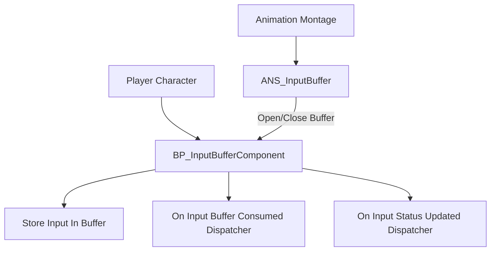

The **Input Buffer System** is a gameplay system designed for Unreal Engine 5 projects to improve responsiveness in action-heavy scenarios, particularly in genres like Souls-like Action RPGs. It allows players to queue an input during animations or other locked states and have it automatically trigger when possible. This prevents missed input issues and enhances player control fidelity.

- **Purpose**: Queue inputs like dodge, sprint, or attack and have them execute when allowed.
- **Problem Solved**: Prevents input loss during animation locks or cooldowns, improving responsiveness.
- **Target Audience**: Unreal Engine developers building action-focused games, especially Souls-likes or fast-paced RPGs.
- **Unique Features**: Frame-precise buffer windows, custom tag-based input routing, support for input state tracking (press/hold/release).

---

## System Architecture

The Input Buffer System is fully Blueprint-based and built around modular components and tag-based input tracking. Key assets include:

- **Blueprints**:
    
    - `BP_InputBufferComponent`: Core component managing the buffer lifecycle, input storage, and consumption.
    - `ANS_InputBuffer`: Anim Notify State controlling the buffer window in animation montages.

- **Structs**:
    - `F_TrackedInputAction`: Tracks how long a particular input has been held or released.

---

## Core Features

- **Input Queuing**: Stores player inputs and triggers them later when the system allows.
- **Buffer Window Control**: Use `ANS_InputBuffer` to define buffer-active frames in animation.
- **Input Status Tracking**: Detects whether the input was Pressed, Held, or Released.
- **Dispatcher Events**: Easily bind to events when a buffer opens, closes, or is consumed.
- **Tag-Based Routing**: Uses Gameplay Tags (e.g., `InputTag.Dodge`) for flexible input mapping.