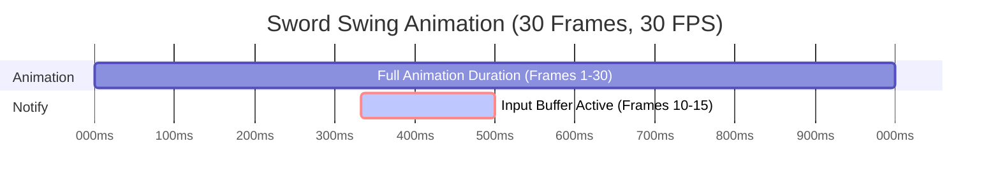

### 1. Binding Input Tags to Actions

1. In Gameplay Tag Manager, define a new tag (e.g., `InputTag.MyNewAction`).
2. Create the Input Action using Enhanced Input.
3. Add New Input Action to desired Input Mapping Context and assign an input to the action
4. In the pawn or character Blueprint:
```blueprint
OnMyInputPressed:
  -> GetInputBufferComponent -> StoreInputInBuffer(InputTag.MyNewAction, true, Press)
OnMyInputReleased:
  -> GetInputBufferComponent -> StoreInputInBuffer(InputTag.MyNewAction, false, Release)
```

#### StoreInputInBuffer Details
`StoreInputInBuffer` has 3 inputs, `InputTag`, `bConsumeInput`, and `E_InputStatus`.

`InputTag`: The input tag associated with the input being stored in the buffer
`bConsumeInput`: By default should this input be consumed? If it's not consumed then nothing will happen upon press, only the `OnInputStatusUpdated` will be called indicated the input has been pressed. Set `bConsumeInput` to true on the event that should trigger the input.
`E_InputStatus`: Update the status of the input in the buffer (e.g. `Press`, `Release`, `Held`)

### 2. Create Action or Ability Associated with Input
1. Using a method appropriate for the systems you're using in your game, create code for an action or ability associated with the input.
2. If using with Advanced Abilities System, create an ability associated with the action:

#### Integration With Abilities System - Bind Abilities To Buffered Inputs
Abilities can be bound to input tags by assigning them to an input tag through an `AbilitySet` or a `CombatStyle` (a child of `AbilitySet`). Once granted, these abilities are registered with their input tags and can be activated by calling `ActivateAbilitiesByTag` on the actor’s `AbilitySystemComponent`. The `OnInputStatusUpdated` dispatcher can also be used to send input status updates to abilities.

To grant input-bound abilities, use `GiveAbilitySets` on the actor’s `AbilitySystemComponent`, or associate the ability with the appropriate weapon `CombatStyle`.

### 3.  Using Dispatcher Events
Bind the following dispatcher(delegate) events in your Character or Pawn:

- `On Input Buffer Opened`
- `On Input Buffer Closed`
- `On Input Buffer Consumed`
- `On Input Status Updated`

Use these to trigger animations, activate abilities or actions, UI feedback, or condition checks.

> [!NOTE] NOTE:
> If using with Advanced Abilities System, the Ability can be activated from the pawn or characters ability system component using the InputTag associated with the input (If the ability was granted and associated with an input tag using an AbilitySet or CombatStyle)

### 4. Create Associated Animation Montage
1. Create Animation Montage for animation associated with the input.
2. Add ANS_InputBuffer to associated animation montage you wish to have an input buffer window:
#### Add Input Buffer Animation Notify State
 As I mentioned on the Input Buffer System page, in order to use the input buffering system you need to add an Animation Notify State, `ANS_InputBuffer`, in your Animation Montages. This will allow you to precisely control the frames of a buffer. During the notify state frames, the inputs will be Queued or stored in a buffer.




> [!NOTE] IMPORTANT NOTE:
>  _If you ever have the issue of the notify state being called twice, E.g. Buffered Input Actions cancel into each other when spamming inputs, make sure to change the Montage Tick Type to Branching Point._

![[Branching Point.png]]

### Example: Dodge Action
1. Setup `InputTag.Dodge`, `IA_Dodge`, and add the new input action to desired `Input Mapping Context`.

2. Create Dodge Input events in Pawn or Character and on Pressed and Released events call `StoreInputInBuffer` from the Pawn or Characters `InputBufferComponent`.
    - Call `StoreInputInBuffer(InputTag.Dodge, true, Press)`
```blueprint
OnMyInputPressed:
  -> StoreInputInBuffer(InputTag.MyNewAction, true, Press)
OnMyInputReleased:
  -> StoreInputInBuffer(InputTag.MyNewAction, false, Release)
```

3. Create Dodge Action or Ability
	1. The dodge ability or action is the part that ultimately plays the dodge animation.

4. In the `On Input Buffer Consumed`, trigger the dodge logic.
```cpp
OnInputBufferConsumed:
// If Using with Abilities System
  -> if(IsAlive()) -> GetAbilitySystemComponent -> TryActivateAbilitiesByTag(->BufferedInputTag) // will use the dodge tag to automatically activate the ability by tag 
  
  // If Using Standalone without Ability System
  -> if(IsAlive() && BufferedInputTag == InputTag.Dodge) -> PerformDodge() // Function for actually performing dodge action and playing dodge animation
```

> [!NOTE] NOTE:
> If integrating with Abilities System be sure to create the corresponding ability and grant the ability using an ability set associated with the input tag. Check Ability System Documentation for more information.

5. Create Dodge Animation
	1. Create as Animation Montage.
	2. Associate animation with Dodge Action or Ability.

6. Add Input Buffer notify state in dodge animation
	1. Adjust to desired position and duration.

7. If Using Abilities System:
	1. Grant Dodge Ability Using a Combat Style or Ability Set, setting the associated tag to `InputTag.Dodge`.
	2. Correctly grant abilities and associate the ability with the input tag
		1. To grant input-bound abilities, use `GiveAbilitySets` on the actor’s `AbilitySystemComponent`, or associate the ability with the appropriate weapon `CombatStyle`.

### Notes
- Only **one input is queued** at a time. The most recent input overrides the previous.
- You may optionally track input holds using `F_TrackedInputAction`.
- Input Buffer system can be extended for ability-based gameplay.

---

## Best Practices

- Use Gameplay Tags to define all bufferable actions.
- Keep notify windows narrow and precise to ensure responsiveness.
- Pair with Enhanced Input for the cleanest integration.
- Test using debug prints in `On Input Buffer Consumed` to verify activation timing.
- Avoid storing multiple overlapping inputs—this system is designed to handle one at a time.

---

## Notes

- Fully Blueprint-driven.
- Compatible with Enhanced Input and Gameplay Tags.
- Pairs well with animation-driven systems like Advanced Abilities.
- Enables responsive gameplay that doesn't punish precise timing.

---