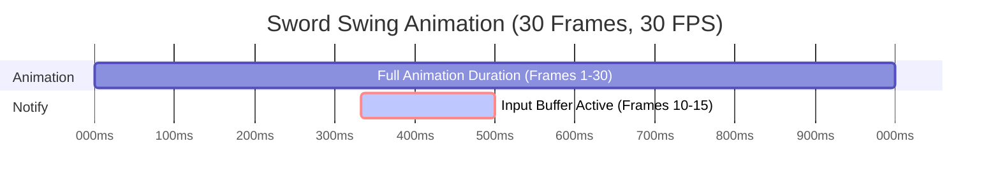

This guide provides detailed instructions on using the `Input Buffering System` in an Unreal Engine 5 project, covering key workflows for queuing inputs, managing buffer states, and extending the system with custom input actions. Users will learn how to trigger buffered inputs, integrate with abilities, and create custom input behaviors for Souls-like Action RPGs. The guide is designed for developers and designers to effectively utilize input queuing for responsive combat mechanics.
### Queuing Inputs

Queue inputs during action commitments to ensure they execute when the buffer window closes.

1. Ensure the `BP_InputBufferComponent` is added to the pawn (e.g., `BP_PlayerCharacter`).
2. On input action events, call `Store Input In Buffer` with the appropriate `InputTag` and `Input Status`:
    
    ```blueprint
    Enhanced Input Action (IA_Dodge, Triggered) -> Get Component By Class (Class: BP_InputBufferComponent) -> Store Input In Buffer (InputTag: InputTag.Dodge, bConsumeInputBuffer: true, Input Status: Pressed)
    ```
    
    ```blueprint
    Enhanced Input Action (IA_Dodge, Completed) -> Get Component By Class (Class: BP_InputBufferComponent) -> Store Input In Buffer (InputTag: InputTag.Dodge, bConsumeInputBuffer: false, Input Status: Released)
    ```
    
3. Verify the input is queued during an `ANS_InputBuffer` window (e.g., in `AM_Heal`).

### Managing Buffer Windows

Control when the input buffer opens and closes using `ANS_InputBuffer` in Animation Montages.

1. Open an Animation Montage (e.g., `SwordSwing_Montage`).
2. Add an `ANS_InputBuffer` Anim Notify State to the frames where input buffering is needed.



> [!NOTE] IMPORTANT NOTE:
>  _If you ever have the issue of the notify state being called twice, E.g. Buffered Input Actions cancel into each other when spamming inputs, make sure to change the Montage Tick Type to Branching Point._

![[Branching Point.png]]

### Managing Buffer States

1. The buffer opens on notify start, queues inputs, and consumes the last input on notify end, triggering `On Input Buffer Consumed`.
2. Bind to buffer state events for additional logic:
    ```blueprint
    BP_InputBufferComponent -> On Input Buffer Opened -> Spawn Emitter At Location (Emitter: BufferStartFX)
    ```
    
    ```blueprint
    BP_InputBufferComponent -> On Input Buffer Closed -> Log Message (Text: Buffer Closed)
    ```

### Handling Consumed Inputs

Process buffered inputs when the buffer consumes them, executing actions or abilities.

1. In `BP_PlayerCharacter`, bind to the `On Input Buffer Consumed` event on `BP_InputBufferComponent`.
2. Use a `Switch on Gameplay Tag` to handle different `InputTag` cases:
    
    ```blueprint
    On Input Buffer Consumed (InputTag) -> Is Character Dead? -> Branch (False) -> Switch on Gameplay Tag (InputTag) ->
      Case InputTag.Dodge -> PerformDodge
      Case InputTag.Attack -> PerformAttack
    ```
    
3. Ensure the pawn validates state (e.g., not dead) before executing actions.

### Integrating with Abilities

Bind abilities to buffered inputs using the `Advanced Abilities System` or custom logic.

1. **Using** `Ability Set` **or** `Combat Style`:
    - In the `Ability Set` or `Combat Style` Data Asset, assign abilities to `InputTag` values (e.g., `InputTag.Dodge` to `GA_Dodge`).
    - Grant the `Ability Set` to the pawn on `Event BeginPlay`:
        ```blueprint
        Event BeginPlay -> Get AbilitySystemComponent -> GiveAbilitySets(AbilitySet: AS_Combat)
        ```
    - Buffered inputs automatically trigger associated abilities when consumed.

2. **Manual Binding**:
    - In `On Input Buffer Consumed`, activate abilities manually:
        ```blueprint
        OnInputBufferConsumed (InputTag: InputTag.Dodge) -> ActivateAbilityByClass(Class: GA_Dodge)
        ```

### Creating Custom Input Actions

Extend the system by adding new input actions with custom behaviors.

1. Create a new `Gameplay Tag` in the Gameplay Tag Manager (e.g., `InputTag.MyNewInput`).
2. In **Project Settings > Input**, create a new **Input Action** (e.g., `IA_MyNewInput`) and map it to a key in the `IMC_Combat` **Input Mapping Context**.
3. In `BP_PlayerCharacter`, bind the input action’s `Pressed` and `Released` events:
    ```blueprint
    Enhanced Input Action (IA_MyNewInput, Triggered) -> Get Component By Class (Class: BP_InputBufferComponent) -> Store Input In Buffer (InputTag: InputTag.MyNewInput, bConsumeInputBuffer: true, Input Status: Pressed)
    ```

    ```blueprint
    Enhanced Input Action (IA_MyNewInput, Completed) -> Get Component By Class (Class: BP_InputBufferComponent) -> Store Input In Buffer (InputTag: InputTag.MyNewInput, bConsumeInputBuffer: false, Input Status: Released)
    ```

> [!NOTE] Note:
> bConsumeInputBuffer determines which StoreInputInBuffer call consumes the input and activates the input action. So set this value to true on the input where you wish for the input to actually happen and set it to false on the other input event.

4. Add `ANS_InputBuffer` to relevant Animation Montages (e.g., `MyAction_Montage`) for buffering.
5. If no montage exists, create Animation Montage for animation associated with the input.
6. In `On Input Buffer Consumed`, add a new case for `InputTag.MyNewInput`:
    ```blueprint
    On Input Buffer Consumed -> Switch on Gameplay Tag -> Case InputTag.MyNewInput -> PerformMyNewAction
    ```

7. Test the new input in-game to ensure it buffers and triggers correctly.

### Example: Dodge Action
1. Setup `InputTag.Dodge`, `IA_Dodge`, and add the new input action to desired `Input Mapping Context`.

2. Create Dodge Input events in Pawn or Character and on Pressed and Released events call `StoreInputInBuffer` from the Pawn or Characters `InputBufferComponent`.
    - Call `StoreInputInBuffer(InputTag.Dodge, true, Press)`
```blueprint
OnMyInputPressed:
  -> StoreInputInBuffer(InputTag.MyNewAction, true, Press)
OnMyInputReleased:
  -> StoreInputInBuffer(InputTag.MyNewAction, false, Release)
```

3. Create Dodge Action or Ability
	1. The dodge ability or action is the part that ultimately plays the dodge animation.

4. In the `On Input Buffer Consumed`, trigger the dodge logic.
```cpp
OnInputBufferConsumed:
// If Using with Abilities System
  -> if(IsAlive()) -> GetAbilitySystemComponent -> TryActivateAbilitiesByTag(->BufferedInputTag) // will use the dodge tag to automatically activate the ability by tag 
  
  // If Using Standalone without Ability System
  -> if(IsAlive() && BufferedInputTag == InputTag.Dodge) -> PerformDodge() // Function for actually performing dodge action and playing dodge animation
```

> [!NOTE] NOTE:
> If integrating with Abilities System be sure to create the corresponding ability and grant the ability using an ability set associated with the input tag. Check Ability System Documentation for more information.

5. Create Dodge Animation
	1. Create as Animation Montage.
	2. Associate animation with Dodge Action or Ability.

6. Add Input Buffer notify state in dodge animation
	1. Adjust to desired position and duration.

7. If Using Abilities System:
	1. Grant Dodge Ability Using a Combat Style or Ability Set, setting the associated tag to `InputTag.Dodge`.
	2. Correctly grant abilities and associate the ability with the input tag
		1. To grant input-bound abilities, use `GiveAbilitySets` on the actor’s `AbilitySystemComponent`, or associate the ability with the appropriate weapon `CombatStyle`.

## Troubleshooting

- **Inputs Not Triggering**:
    - Confirm `On Input Buffer Consumed` is bound and handles the correct `InputTag`.
    - Ensure `ANS_InputBuffer` is on the Animation Montage and the montage plays correctly.
    - Verify `bConsumeInputBuffer` is `true` for the intended trigger event (`Pressed` or `Released`).
- **Buffer Not Opening**:
    - Check that `ANS_InputBuffer` is correctly placed in the Animation Montage and the Animation Blueprint references it.
    - Ensure `BP_InputBufferComponent` is not disabled on the pawn.
- **Unexpected Input Behavior**:
    - Verify unique `InputTag` values to avoid conflicts.
    - Check that `bConsumeInputBuffer` is `false` for non-trigger events to prevent premature consumption.
- **Abilities Not Activating**:
    - For `Advanced Abilities System`, ensure abilities are granted via `Ability Set` or `Combat Style` with matching `InputTag` values.
    - Confirm the pawn has the `Gameplay Ability System` component and abilities are not blocked.

## Best Practices

- **Workflows**:
    - Use hierarchical `InputTag` naming (e.g., `InputTag.Combat.Dodge`) for organization.
    - Test new inputs with existing Animation Montages before creating custom ones.
    - Centralize input handling in `On Input Buffer Consumed` for maintainability.
- **Pitfalls to Avoid**:
    - Don’t add `ANS_InputBuffer` to every Animation Montage; reserve it for committed actions.
    - Avoid binding `On Input Buffer Consumed` multiple times, as it may cause duplicate executions.
    - Don’t set `bConsumeInputBuffer` to `true` for both `Pressed` and `Released` unless intentional.
- **Performance Considerations**:
    - Use specific `InputTag` filters in `Store Input In Buffer` to avoid queuing irrelevant inputs.
    - Optimize `On Input Buffer Consumed` logic to avoid complex branching for large input sets.