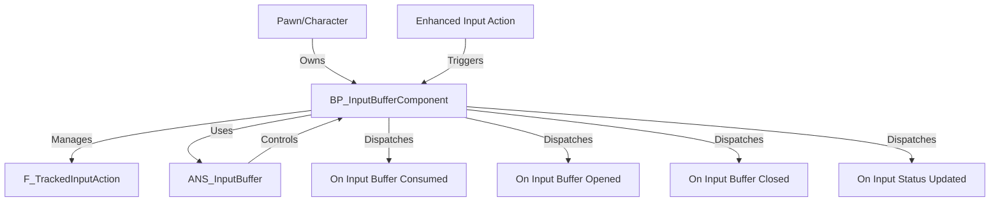

The `Input Buffering System` is a Blueprint-based system for Unreal Engine 5 projects, designed to queue player inputs during action commitments, ensuring responsive gameplay in Souls-like Action RPGs. It enables developers to capture and process inputs when abilities block other actions, preventing missed inputs and enhancing player control. The system addresses the problem of unresponsive gameplay by queuing inputs (e.g., dodge or attack) during abilities like healing, executing them when the buffer window closes. Targeted at game developers and designers building combat-heavy games, its standout features include seamless integration with the `Advanced Abilities System`, animation-driven buffer control, and customizable input tracking.

## System Architecture

The `Input Buffering System` centers around the `BP_InputBufferComponent`, which manages input queuing and consumption. Blueprints handle input storage, event dispatching, and animation-driven buffer control, with no C++ dependencies for accessibility. The system integrates with the Enhanced Input System and `Gameplay Tags` for input identification, and optionally with the `Advanced Abilities System` for ability binding.

- **Key Blueprint Classes**:
    - `BP_InputBufferComponent`: Core component that queues inputs, tracks their status (`Pressed`, `Released`, `Held`), and triggers them when consumed. 
    - `ANS_InputBuffer`: Animation Notify State that opens the input buffer at the start of specified animation frames and consumes the queued input when the notify ends, enabling precise buffer timing.
    - `F_TrackedInputAction`: Struct that stores input details, including the `Gameplay Tag`, status, and hold duration, used to track inputs for timed or held actions.

- **Data Flow**:
    - Inputs are captured via Enhanced Input actions and stored in `BP_InputBufferComponent` using `Store Input In Buffer` with a `Gameplay Tag` (e.g., `InputTag.Dodge`).
    - `ANS_InputBuffer` opens the buffer during an animation (e.g., healing montage), queuing inputs.
    - When `ANS_InputBuffer` ends, the buffer consumes the most recent input, triggering `On Input Buffer Consumed` to execute the associated action or ability.
    - Events like `On Input Buffer Opened`, `On Input Buffer Closed`, and `On Input Status Updated` notify other systems of buffer state changes.

## Core Features

- **Input Queuing**:
    - Queues a single input (last input takes priority) during action commitments, executing it when the buffer window closes.
    - **Benefits**: Prevents missed inputs, ensuring responsive gameplay during blocking abilities like healing or tool use.
- **Animation-Driven Buffer Control**:
    - Uses `ANS_InputBuffer` to open/close the input buffer during specific animation frames, aligning input queuing with action visuals.
    - **Benefits**: Provides precise control over when inputs are buffered, enhancing combat flow in Souls-like games.
- **Customizable Input Tracking**:
    - Tracks input status (`Pressed`, `Released`, `Held`) and hold duration via `F_TrackedInputAction`, supporting timed or held input actions.
    - **Benefits**: Enables varied input behaviors, such as different actions for short vs. long presses.
- **Trigger Inputs**:
    - Input Buffer events (`On Input Buffer Consumed`, `On Input Buffer Opened`, `On Input Buffer Closed`, `On Input Status Updated`) notify other systems of buffer state changes.
    - **Benefits**: Facilitates integration with custom logic or the `Advanced Abilities System` for ability triggering.
- **Seamless Ability Integration**:
    - Automatically binds abilities to input tags via `Ability Set` or `Combat Style` when used with the `Advanced Abilities System`.
    - **Benefits**: Simplifies ability activation based on buffered inputs, reducing setup complexity.
- **Input Consumption Control**:
    - Allows developers to mark inputs as consumed or not via `Add Consumed Input Buffer Key` or `bConsumeInputBuffer`, controlling which inputs trigger actions.
    - **Benefits**: Provides fine-tuned control over input behavior, preventing unwanted activations.