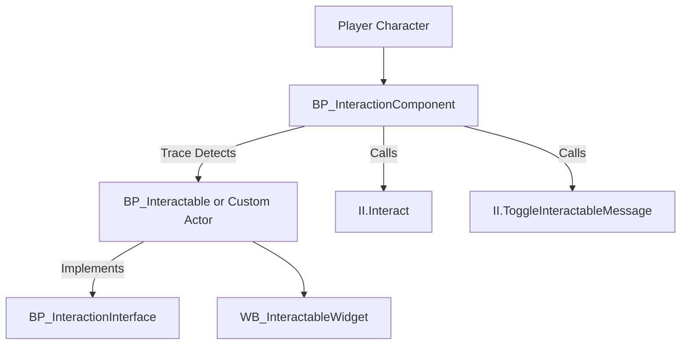

---
aliases:
  - Interaction System
---

The **Advanced Interaction System** is a modular Blueprint-based framework included in the Advanced ARPG Combat system. It enables dynamic interactions between player-controlled characters (interactors) and interactable world objects (e.g., chests, NPCs, bonfires).

This system solves the common need for a reusable, scalable interaction framework that can power a wide range of gameplay mechanics—from simple prompts to complex context-sensitive behaviors. It is especially useful for developers creating action RPGs, adventure games, or any genre requiring interaction with world elements.

![[Interaction System Bonfire.png]]

**Key Features**:

- Fully interface-driven architecture
- Modular, customizable interaction logic
- Widget support for visual prompts
- Integration-ready with animation, UI, and ability systems

---

## System Architecture

The system is built entirely in Blueprints and uses a component-interface design pattern. Below is a high-level diagram of the interaction flow:

### Key Blueprint Classes

- **BP_InteractionComponent**: Manages traces, interaction toggling, and event dispatch.
- **BP_InteractionInterface**: Interface used to implement interaction logic on actors.
- **BP_Interactable**: Example actor that implements the interface and includes a widget.
- **WB_InteractableWidget**: UI element shown when an actor is in range and interactable.
- **ANS_Interact**: Animation notify state to trigger interaction states during animations.

---

## Core Features

- **Interactable Tracing**: Performs timed capsule traces to detect interactables.
- **Toggle Message Display**: Sends `ToggleInteractableMessage` to display or hide interaction widgets.
- **Interaction Event Handling**: Calls `Interact` with a reference to the initiator, allowing custom reactions.
- **End Interaction**: Ends or cleans up ongoing interaction logic.
- **Start Interactable Action**: Enables external systems to trigger specific context-sensitive behavior.
- **Animation Notify Integration**: Use `ANS_Interact` to sync interaction states with animation cues.