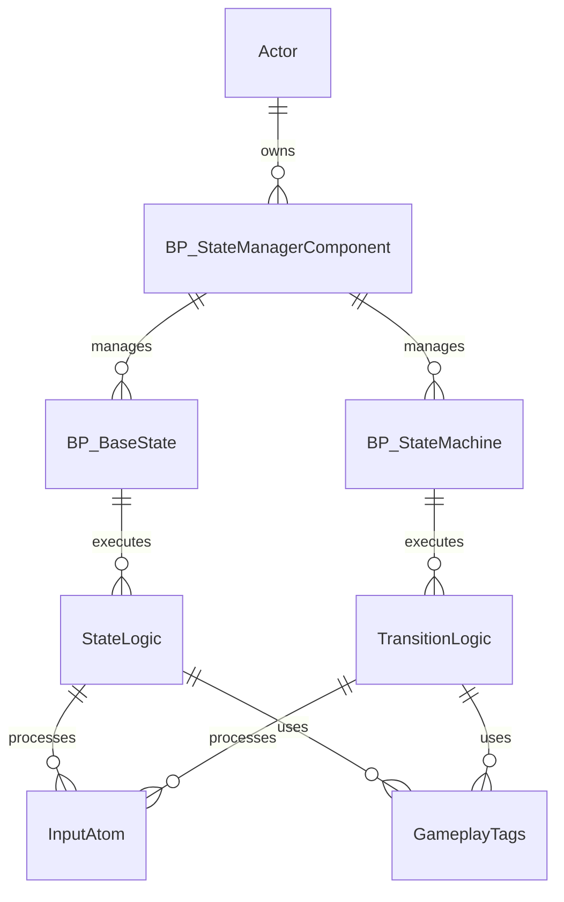

---
aliases:
  - State Manager System
---
The **Advanced State Manager** is a flexible, Blueprint-based system for managing and transitioning between discrete game states on any actor. Designed for Unreal Engine 5 projects, it provides developers with a modular, scalable solution for implementing state-driven logic, such as character behaviors, animation states, or AI logic.

This system solves the problem of managing complex state transitions cleanly and efficiently without deeply coupling logic. It is especially valuable for developers working on RPGs, action games, or behavior-driven systems.

**Key Features:**

- Modular state object architecture
- Finite state machine support
- Built-in support for state timing and transitions
- Supports event-driven state changes and inputs

---

## System Architecture

The State Manager system uses a component-and-UObject design pattern. State objects encapsulate logic for specific states, while a central component manages transitions and dispatching.

### Key Blueprint Classes

- **BP_StateManagerComponent**: Controls state execution and transitions.
- **BP_BaseState**: Base class for defining custom states (enter, exit, and transition logic).
- **BP_StateMachine**: Subclass of `BP_BaseState`, supports custom transition logic between states.
- **BP_InputAtom**: Atom used to represent input data for transition logic.

---

## Core Features

- **State Activation**: Dynamically activate states using class or tag references.
- **State Transition Management**: Transition between multiple states with condition checks.
- **State Machines**: Encapsulate multi-state transition logic inside custom state machine classes.
- **Input Atoms**: Add/remove input tokens used for influencing state behavior.
- **Dispatcher Integration**: Notify external systems on state enter/exit.
- **Time Tracking**: Built-in timing for active states.

