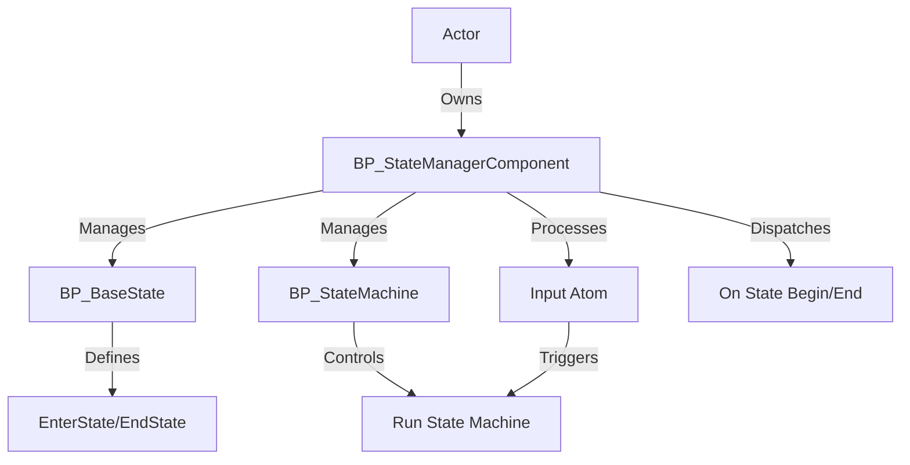

---
aliases:
  - State Manager System
---
The `State Manager System` is a Blueprint-based system for Unreal Engine 5 projects, designed to manage and control multiple states for actors, such as characters or AI, in complex Action RPGs. It enables developers to define state behaviors, handle transitions, and respond to events, simplifying the implementation of finite state machines (FSMs). The system addresses the need for modular, reusable state management, making it easy to create and transition between states like idle, attacking, or stunned. Targeted at game developers and designers building RPGs or AI-driven games, its standout features include flexible state transitions, `Gameplay Tag`-based state identification, and robust support for AI behavior through state machines.

## System Architecture

The `State Manager System` revolves around the `BP_StateManagerComponent`, which manages states and transitions for an actor. Blueprints handle state logic, transitions, and input processing, with no C++ dependencies for accessibility. The system uses `Gameplay Tags` for state and event identification, and `Input Atom` assets for input processing, enabling modular state-driven behavior.

- **Key Blueprint Classes**:
    
    - `BP_StateManagerComponent`: Core component that manages an actor’s states, tracks the active state, and facilitates transitions. It handles state entry, exit, and event dispatching.
    - `BP_BaseState`: UObject-derived Blueprint defining state behavior, including entry (`EnterState`), exit (`EndState`), and transition logic (`Run State Machine`).
    - `BP_StateMachine`: UObject-derived Blueprint extending `BP_BaseState`, acting as a centralized FSM to manage state transitions in response to events or inputs.
    - `Input Atom`: Data Asset representing an indivisible unit of input data, used to trigger state transitions or events in the FSM.
- **Data Flow**:
    
    - `BP_StateManagerComponent` is added to an actor (e.g., `BP_PlayerCharacter`) and configured with default states via `State Classes` or `Default State`.
    - States are entered using `Enter State By Tag` or `Enter State By Class`, triggering `On State Begin` and executing `EnterState` logic in the corresponding `BP_BaseState`.
    - `BP_StateMachine` processes events via `Send Event To State Machine` or runs transitions via `Run State Machine By Tag`, calling `Run State Machine` in the state class.
    - `Input Atom` assets are added to the state manager via `Add Input Atom`, influencing transitions or state behavior.
    - State exits trigger `On State End` and `EndState`, allowing cleanup or notifications.

## Core Features

- **State Management**:
    - Manages multiple states for an actor, allowing entry and exit via `Enter State By Tag` or `Enter State By Class`.
    - **Benefits**: Simplifies state-driven behavior for characters or AI, reducing complexity in state handling.
- **Flexible State Transitions**:
    - Supports transitions between states using `Run State Machine` in `BP_BaseState` or `BP_StateMachine`, driven by events or conditions.
    - **Benefits**: Enables dynamic state changes, such as switching from idle to attacking based on input or AI logic.
- **Event Dispatching**:
    - Dispatches `On State Begin` and `On State End` events to notify other systems of state changes.
    - **Benefits**: Facilitates integration with gameplay systems, like triggering animations or effects on state entry/exit.
- **Input Atom Processing**:
    - Processes `Input Atom` assets to trigger state transitions or events via `Add Input Atom` and `Send Event To State Machine`.
    - **Benefits**: Provides a modular way to handle input-driven state changes, enhancing flexibility.
- **State Time Tracking**:
    - Tracks active state duration via `bTrackStateActiveTime` and `Get State Time`, useful for timed states like stuns or buffs.
    - **Benefits**: Enables precise control over state behavior based on duration.
- **AI Behavior Support**:
    - Uses `BP_StateMachine` to define complex AI behaviors, managing transitions for states like patrolling, chasing, or attacking.
    - **Benefits**: Streamlines the creation of advanced, modular AI FSMs for bosses or enemies.