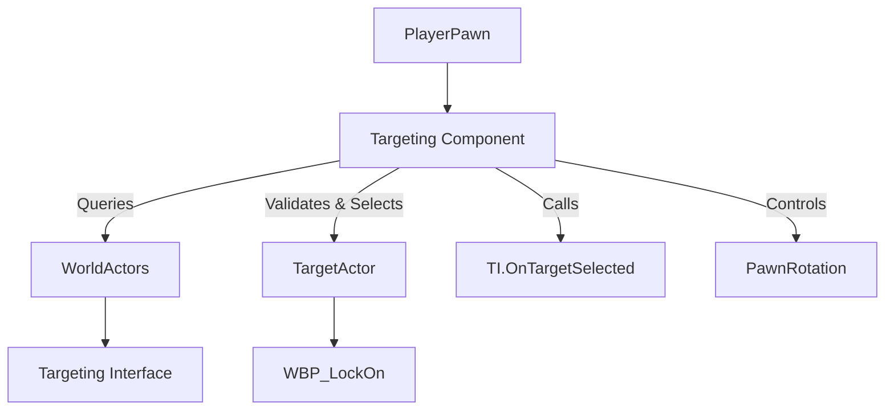

The **Advanced Targeting System** is a modular Blueprint-based targeting solution designed for Unreal Engine 5 projects. It enables precise and responsive lock-on targeting behavior, similar to mechanics found in action RPGs and souls-like titles. Integrated with the Advanced ARPG Combat system, this system provides smooth camera targeting, dynamic target switching, and customizable target validation.

This system addresses the need for responsive target acquisition, context-aware target selection, and robust behavior across varying combat scenarios. It is intended for developers working on action games, RPGs, or any project requiring directional targeting.

![[Screenshot 2025-05-06 105004.png]]

**Key Features:**

- Lock-on targeting with smooth rotation
- Target switching (left/right)
- Line-of-sight validation
- Configurable targeting parameters
- Visual targeting indicator (lock-on widget)

---

## System Architecture

The system is component-driven and interface-based, allowing designers and developers to integrate targeting functionality into any pawn and make any actor targetable.

### Key Blueprint Classes

- **BP_TargetingComponent**: Manages all lock-on logic. Attached to player-controlled pawns.
- **BP_TargetingInterface**: Interface implemented by actors to be targetable.
- **WBP_LockOn**: Lock-on UI widget rendered over the selected target.

---

## Core Features

- **Lock-On Targeting**
    - Players can lock onto a target within range.
    - Character rotation is automatically aligned with the target.
- **Target Switching**
    - Players can cycle between nearby targets (left/right).
    - Prioritizes based on screen position and distance.
- **Line-of-Sight Validation**
    - Ensures that the player can see the target.
    - Ignores targets hidden behind walls or obstacles.
- **Customizable Parameters**
    - Define targeting radius, trace type, and object filters.
    - Adjust camera or rotation behavior when locked.
- **Targeting Widget Support**
    - Adds a widget (e.g., `WBP_LockOn`) to the targeted actor.
    - Custom widgets can be supported through the interface.
- **Automatic Retargeting**
    - Optionally retarget if the current target becomes invalid.
    - Maintains fluid targeting in active combat.