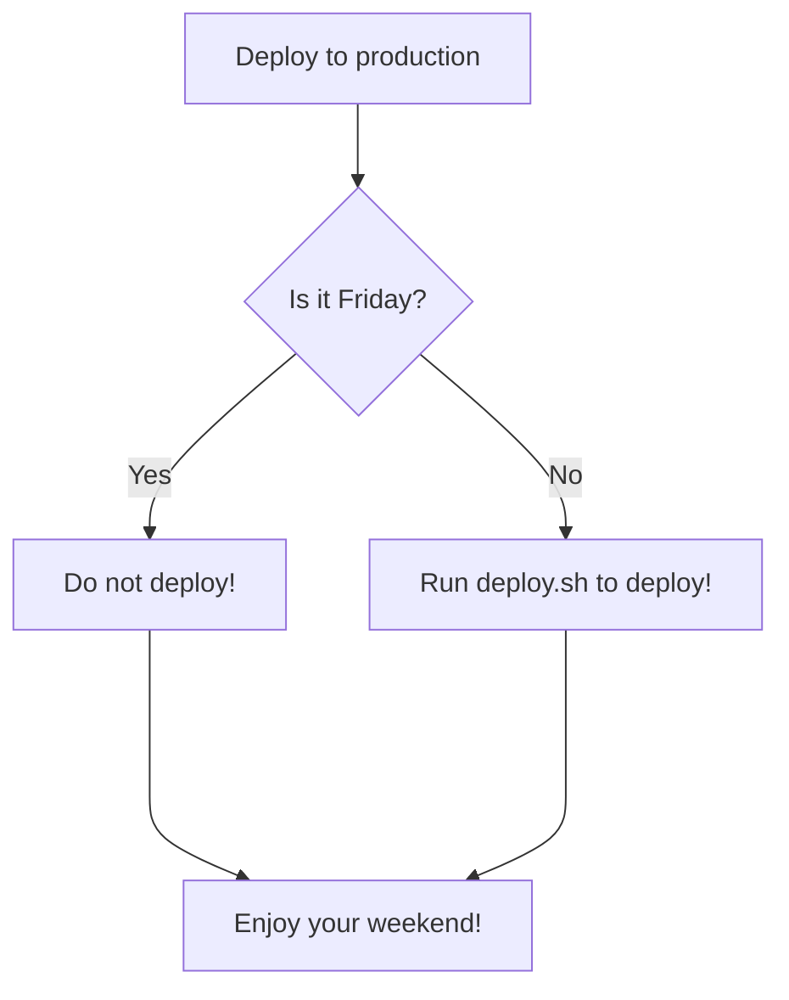

Hello everyone and welcome to the new place for Game Code Mastery documentation!

You might be wondering why this is going to be the new home for documentation for my projects. Below, I will explain in a bit more detail why I’m making this change and how it enhances my documentation:

# Switching to Quartz and Github Pages
I’m transitioning my Unreal Engine project documentation from Wikiful to Quartz, a static-site generator, paired with Github pages. This change will streamline my workflows, enhance navigation, and supports scalable, high-quality documentation that evolves with my projects. 

## Why Move from Wikiful?
 I enjoyed using Wikiful as it is simple and user-friendly, but it is missing some key features I need:

1. **Lack of Markdown Support**: I'm experienced with the markdown syntax and prefer it's workflow for writing documentation.
2. **Lack of Advanced Tools**: Wikiful Lacks advanced tools like code highlighting and has limited headings.
 3. **Customization Constraints**: Wikiful Offers minimal customization and design flexibility and doesn't offer a dark mode. 
4. **Wikiful issues**: Wikiful works well the vast majority of the time and is a great service, but I have experienced corrupted pages and corrupted account settings with Wikiful.

As a result I felt a more robust solution would help me create better documentation for Advanced ARPG Combat.

## Why Quartz and Github Pages?
Primarily because I wanted more customization and better markdown support. Quartz allows me to integrate my site directly with Obsidian, which is a markdown based note taking system I use to actually write the documentation. Over time I have grown to really appreciate the versatility, portability, and simplicity of markdown. So I wanted a markdown based solution that integrates better with my workflow. 

Here are more details of the benefits of this change:

1. **Markdown based Solution**: Markdown is a simple and easy-to-use markup language you can use to format virtually any document:

```cpp
/*
* Making a word code is as simple as `example` and adding a code block is as simple as ```
* Supports headings: # for heading 1, ## for heading 2, ### for heading 3, etc
* divide pages with ---
* 1, 2, 3, etc for numbered lists and - for unnumbered lists and more.
* 
* This code block is set for C++ syntax highlighting which 
* is very useful for Unreal Engine related documentation
*/

#include <iostream>

int main(){

std::cout << "Hello World! " << std::endl;

}

```

2. Support for Mermaid Diagrams
```cpp
/* This site is also able to support Mermaid Diagrams which 
* Mermaid is a JavaScript based diagramming and charting tool 
* that takes Markdown-inspired text definitions and creates diagrams
* dynamically in the browser.
*/

	// Mermaid converts the following text into a diagram
	flowchart TD
	A[Deploy to production] --> B{Is it Friday?};
	B -- Yes --> C[Do not deploy!];
	B -- No --> D[Run deploy.sh to deploy!];
	C ----> E[Enjoy your weekend!];
	D ----> E[Enjoy your weekend!];
```



> [!NOTE] NOTE:
>  Since this is a Github based solution, you can download the markdown files HERE if you would like to have an offline markdown version: https://github.com/GameCodeMastery/documentation/

2. **Version Control**: With this new solution I can utilize git version control to more finely tune the different versions of the documentation so that I can apply and revert changes as needed.
3. **Dark Mode:** Funny enough having a dark mode is a huge deal for me as I use dark mode for everything and when working at night I don't like being blinded by a bright white screen. So having dark mode makes writing or reading the documentation at night less straining.
4. **Portability:** I can write the documentation in any markdown based solution and use those same markdown files to publish in my official documentation.
5. **Nicer Layout**: In addition to dark mode, I also prefer the nicer layout along with features like an automatic Table of Contents that is on the right side of every document. 
6. **Obsidian Integration**: I use Obsidian as my primary application for writing the documentation, Quartz allows me to easily integrate with Obsidian.
7. **Customization**: With Quartz I can fully customize this site by installing custom plugins and extensions. So if I want to add a specific feature that isn't available on Wikiful I can do so provided I can make it in HTML and CSS. 

When I discovered Quartz and realized how using Quartz together with Markdown improved my workflow and documentation quality I knew this change was the right decision. I hope you all are looking forward to the new direction for my content and the documentation!


